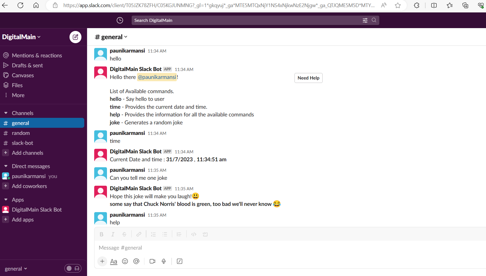
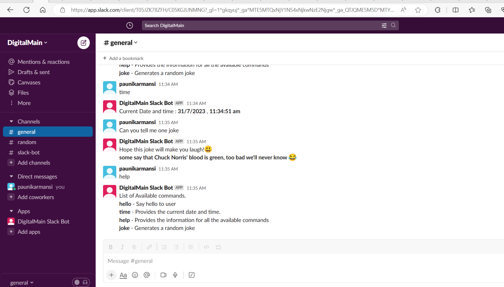

## Slack Bot Development

This project involves creating a Slack bot that can respond to various commands and provide information based on user input. The boat was developed using a Slack bot framework/library (Node.js with @slack/bolt).

## Objective

The main objective of this project is to build a functional Slack bot that can respond to the following commands:

1. `hello`: The bot will reply with a greeting message like "Hello there!" and provide a "Need Help" button that provides information about the available commands.
2. `help`: The bot will display a list of available commands and their usage instructions.
3. `time`: The bot will provide the current date and time.
4. `joke`: The bot will generate a random joke using a third-party API ("getjoke").
5. Invalid commands: The bot handle invalid commands or unexpected input gracefully by responding with "Invalid command" error messages

Additionally, the bot displays "Need Help" button on `hello` message that provides information about the available commands.

## Development

To run the Slack bot locally for development, follow these steps:

1. Clone this repository to your local machine.
2. Install the required dependencies using `npm install` (for Node.js) or `pip install` (for Python).
3. Set up the necessary configuration for your Slack bot and API access tokens.
4. Start the bot using the appropriate command for your chosen framework.

## Testing

To ensure the bot works correctly and handles different scenarios gracefully.The following areas should be tested:

1. Test each command (`/hello`, `/help`, `/time`, and `/joke`) to verify their correct functionality.
2. Test the bot's response to invalid commands or unexpected input to ensure appropriate error messages are displayed.

## Output Images

